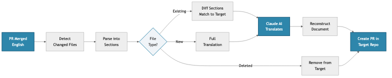

<!-- _class: lead -->

# Translation Sync Action

**AI-Powered Translation Automation for Documentation**

GitHub Action • Claude Sonnet 4.5 • MyST Markdown

_QuantEcon Project_

---

# What It Does

**Automatically translates documentation when source content changes**

Monitor merged PRs → Detect changes → Translate → Create review PR

## Key Capabilities

✓ **Smart Diff Translation** – Only translates modified sections
✓ **Recursive Subsections** – Full support for nested headings (##-######)
✓ **Language Configuration** – Extensible system for language-specific rules
✓ **MyST Markdown Aware** – Preserves code, math, directives
✓ **Consistent Terminology** – Built-in glossaries (355+ terms for zh-cn)
✓ **Review Workflow** – All translations go through PR review
✓ **GPT5 Validated** – 100% pass rate on comprehensive test suite

---

# How It Works

## Section-Based Translation Approach

### ❌ Problem: Block-Level

- Can't match across languages
- Loses translation context
- Complex mapping logic

### ✅ Solution: Section-Based

- Match by position
- Translate full sections
- Simple: Add, Update, Delete

---

# Translation Workflow

---

# LLM-Powered Translation (Claude Sonnet 4.5)

### UPDATE Mode
_(changed sections)_

- Sends: old EN + new EN + current translation
- Claude understands what changed
- Preserves style and terminology
- Uses glossary for consistency

### NEW Mode
_(new sections)_

- Translates with full context
- Uses glossary for consistency
- Maintains document structure

---

# Status & Getting Started

## Current Status

📦 **v0.5.1** – Production-Ready
✨ **Language-Extensible Architecture**
✅ 147 tests passing (100%)
🧪 24 GitHub test scenarios

## Use Cases

- Multi-language documentation
- Educational content (QuantEcon lectures)
- Technical documentation
- OSS localization
- Academic papers

## Resources

**GitHub**  
quantecon/action-translation-sync

**Docs**  
10 comprehensive guides in `docs/`

**Tools**
- Bulk translator for initial setup
- GitHub testing framework

**License**  
MIT

