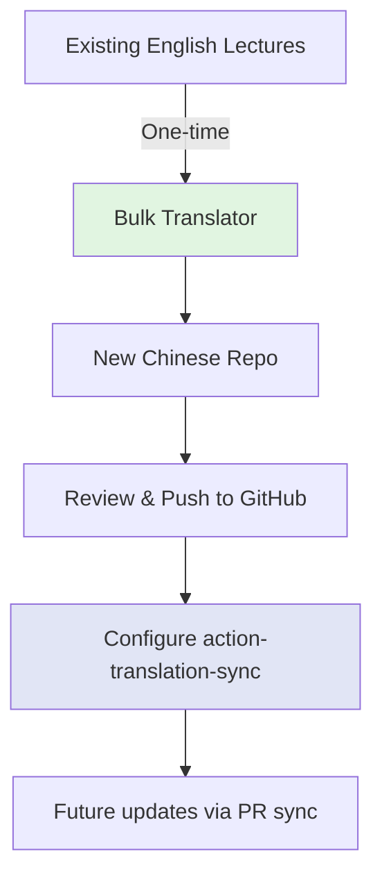

# Bulk Translator Tool# Bulk Translator Tool# Bulk Translator Tool


A standalone CLI tool for **one-time bulk translation** of entire Jupyter Book lecture series using Claude AI.


## PurposeStandalone CLI tool for **one-time bulk translation** of entire Jupyter Book lecture series using Claude AI.A standalone tool for initial bulk translation of an entire lecture series to bootstrap a new language repository.


This tool is designed for **initial setup** when creating a new language version of an existing lecture series. After the initial bulk translation, use the main `action-translation-sync` GitHub Action for incremental updates.


**Use Case**: Creating `lecture-python.zh-cn` from `lecture-python`## Purpose## Purpose


## Quick Start


```bash- **Use Case**: Initial setup of new language repository (e.g., creating `lecture-python.zh-cn` from `lecture-python`)This tool is designed for **one-time initial setup** when creating a new language version of an existing lecture series. After the initial bulk translation, use the main `action-translation-sync` GitHub Action for incremental updates.

# 1. Install

cd tool-bulk-translator- **Translation Strategy**: One lecture at a time for better quality, context, and terminology consistency

npm install

- **After Setup**: Use main `action-translation-sync` for incremental updates## Architecture

# 2. Preview (no API keys needed for public repos)

npm run translate -- \

  --source-repo QuantEcon/lecture-python-intro \

  --target-folder /tmp/preview \## Quick StartThe tool focuses on **high-quality single-lecture translation**:

  --target-language zh-cn \

  --docs-folder lectures \

  --dry-run

```bash1. **Repository Setup**: Creates target folder with language suffix (e.g., `lecture-python.zh-cn`)

# 3. Actual translation

export ANTHROPIC_API_KEY="your-api-key"# 1. Install dependencies2. **File Preservation**: Copies all non-.md files (images, configs, data) to maintain Jupyter Book structure

export GITHUB_TOKEN="your-github-token"

cd tool-bulk-translator3. **Sequential Translation**: Processes one lecture at a time from `_toc.yml` for focused, coherent translations

npm run translate -- \

  --source-repo QuantEcon/lecture-python \npm install4. **Quality Focus**: Each lecture gets full LLM context for terminology consistency and narrative flow

  --target-folder lecture-python.zh-cn \

  --target-language zh-cn \

  --docs-folder lectures

```# 2. Set environment variables## Why One Lecture at a Time?


## Command Optionsexport ANTHROPIC_API_KEY="your-api-key"


| Option | Required | Description |export GITHUB_TOKEN="your-github-token"**Quality Benefits**:

|--------|----------|-------------|

| `--source-repo` | Yes | Source repository (`owner/repo`) |- ✅ Focused context within single topic

| `--target-folder` | Yes | Local folder path for translations |

| `--target-language` | Yes | Target language code (`zh-cn`, `ja`, `es`) |# 3. Run translation- ✅ Consistent terminology throughout lecture

| `--source-language` | No | Source language code (default: `en`) |

| `--docs-folder` | No | Docs folder in repo (default: `lectures/`) |npm run translate -- \- ✅ Better handling of math/code in context

| `--anthropic-api-key` | No* | Anthropic API key (not needed for `--dry-run`) |

| `--github-token` | No* | GitHub PAT (optional for public repos in `--dry-run`) |  --source-repo QuantEcon/lecture-python \- ✅ Coherent narrative flow (intro → body → conclusion)

| `--glossary-path` | No | Custom glossary file (default: built-in) |

| `--batch-delay` | No | Delay between lectures in ms (default: `1000`) |  --target-folder ~/translations/lecture-python.zh-cn \

| `--resume-from` | No | Resume from specific lecture file |

| `--dry-run` | No | Preview lectures without translating |  --target-language zh-cn**Practical Benefits**:


*Required for actual translation, optional for `--dry-run` mode with public repositories```- ✅ Stays within token limits for large lectures


## Dry-Run Mode- ✅ Independent error recovery per lecture


Preview what will be translated **without making any API calls or creating files**:## Command Options- ✅ Clear progress tracking (15/50 done)


```bash- ✅ Easy quality spot-checking

npm run translate -- \

  --source-repo QuantEcon/lecture-python-intro \| Option | Required | Default | Description |

  --target-folder /tmp/preview \

  --target-language zh-cn \|--------|----------|---------|-------------|## Prerequisites

  --docs-folder lectures \

  --dry-run| `--source-repo` | ✅ | - | Source repository (`owner/repo`) |

```

| `--target-folder` | ✅ | - | Local output folder path |- Node.js 18+ and npm

**What dry-run does**:

- ✅ Fetches `_toc.yml` from GitHub repository| `--target-language` | ✅ | - | Target language code (`zh-cn`, `ja`, `es`) |- Anthropic API key (Claude access)

- ✅ Lists all lectures that would be translated

- ✅ Shows lecture count and file paths| `--source-language` | ❌ | `en` | Source language code |- GitHub Personal Access Token (for repo access)

- ❌ **No API calls to Claude** (zero cost)

- ❌ **No files created** on disk| `--docs-folder` | ❌ | `lectures/` | Docs folder in repo |- Source repository access (read)

- ❌ **No API keys needed** for public repositories

| `--anthropic-api-key` | ✅ | - | Anthropic API key |- Target repository created (write access)

**Perfect for**:

- Verifying correct repository and folder| `--github-token` | ✅ | - | GitHub PAT |

- Checking lecture count before translation

- Testing configuration without costs| `--glossary-path` | ❌ | Built-in | Custom glossary file |## Installation

- Quick sanity check before bulk operation

| `--batch-delay` | ❌ | `1000` | Delay between lectures (ms) |

**Example output**:

```| `--resume-from` | ❌ | - | Resume from specific file |```bash

🔍 DRY RUN MODE - No changes will be made

cd tool-bulk-translator

Source: QuantEcon/lecture-python-intro

Target: /tmp/preview## How It Worksnpm install

Language: en → zh-cn

```

✔ Found 49 lectures in TOC

1. **Setup**: Validates inputs, loads glossary, initializes Claude API

Would translate the following lectures:

  1. lectures/about.md2. **Prepare**: Clones source repo, copies non-.md files (images, configs, data)## Usage

  2. lectures/long_run_growth.md

  ...3. **Translate**: Processes each lecture from `_toc.yml` sequentially

  49. lectures/status.md

4. **Generate**: Creates heading-maps, preserves MyST formatting### Basic Command

To actually run translation, execute without --dry-run

```5. **Report**: Outputs translation summary with stats


## How It Works```bash


### Translation Strategy### Why One Lecture at a Time?npm run translate -- \


The tool uses a **one-lecture-at-a-time approach** for optimal quality:  --source-repo QuantEcon/lecture-python \


1. **Sequential Processing**: Translates each lecture from `_toc.yml` in order**Quality**:  --target-folder lecture-python.zh-cn \

2. **Full Context**: Each lecture gets complete LLM attention

3. **Auto Heading-Maps**: Generates maps for cross-language section matching- Full context for terminology consistency  --source-language en \

4. **Structure Preservation**: Maintains all Jupyter Book structure

- Coherent narrative flow  --target-language zh-cn \

### Why One Lecture at a Time?

- Better math/code handling  --docs-folder lectures/ \

**Quality Benefits**:

- ✅ Focused context within single topic  --anthropic-api-key $ANTHROPIC_API_KEY \

- ✅ Consistent terminology throughout lecture

- ✅ Better handling of math/code in context**Practical**:  --github-token $GITHUB_TOKEN

- ✅ Coherent narrative flow (intro → body → conclusion)

- Stays within token limits```

**Practical Benefits**:

- ✅ Stays within token limits for large lectures- Independent error recovery

- ✅ Independent error recovery per lecture

- ✅ Clear progress tracking (15/50 done)- Clear progress tracking### Options

- ✅ Easy quality spot-checking


### Workflow

## Features| Option | Required | Description |

1. **Setup**: Validates inputs, loads glossary, initializes Claude API

2. **Prepare**: Downloads source repo, copies non-.md files (images, configs, data)|--------|----------|-------------|

3. **Translate**: Processes each lecture from `_toc.yml` sequentially

4. **Generate**: Creates heading-maps, preserves MyST formatting- ✅ **Glossary Support**: Uses built-in or custom glossaries for consistent terminology| `--source-repo` | Yes | Source repository (owner/repo) |

5. **Report**: Outputs translation summary with stats

- ✅ **Heading-Maps**: Auto-generates for cross-language section matching| `--target-folder` | Yes | Local folder name for translations |

## Features

- ✅ **Progress Tracking**: Real-time spinner and status updates| `--source-language` | No | Source language code (default: `en`) |

- ✅ **Glossary Support**: Uses built-in or custom glossaries for consistent terminology

- ✅ **Heading-Maps**: Auto-generates for cross-language section matching  - ✅ **Error Handling**: Automatic retries with exponential backoff| `--target-language` | Yes | Target language code (e.g., `zh-cn`, `ja`, `es`) |

- ✅ **Progress Tracking**: Real-time spinner and status updates

- ✅ **Error Handling**: Automatic retries with exponential backoff- ✅ **Resume Capability**: Continue from last successful lecture| `--docs-folder` | No | Documentation folder in repo (default: `lectures/`) |

- ✅ **Resume Capability**: Continue from last successful lecture

- ✅ **Structure Preservation**: Maintains Jupyter Book folder structure- ✅ **Structure Preservation**: Maintains Jupyter Book folder structure| `--anthropic-api-key` | Yes | Anthropic API key for Claude |

- ✅ **Dry-Run Mode**: Preview without costs or changes

| `--github-token` | Yes | GitHub PAT for repo access |

## Output

## Output| `--glossary-path` | No | Custom glossary file (default: uses built-in) |

After completion:

| `--batch-delay` | No | Delay between lectures in ms (default: `1000`) |

```

target-folder/After completion:| `--resume-from` | No | Resume from specific lecture file |

├── _toc.yml                  # Copied from source

├── _config.yml               # Copied from source

├── lectures/

│   ├── lecture1.md          # Translated with heading-map```### Example: Chinese Translation

│   ├── lecture2.md          # Translated with heading-map

│   └── ...target-folder/

├── images/                   # Copied from source

└── translation-report.md     # Generated summary├── _toc.yml                  # Copied```bash

```

├── _config.yml               # Copiedexport ANTHROPIC_API_KEY="your-api-key"

Each translated file includes:

- Frontmatter with `heading-map` for section matching├── intro.md                  # Translated with heading-mapexport GITHUB_TOKEN="your-github-token"

- Translated content preserving MyST syntax

- Original code cells, math blocks, and special directives├── lectures/


## Integration Workflow│   ├── lecture1.md          # Translatednpm run translate -- \


1. **Initial Bulk Translation** (this tool):│   ├── lecture2.md          # Translated  --source-repo QuantEcon/lecture-python \

   ```bash

   npm run translate -- \│   └── ...  --target-folder lecture-python.zh-cn \

     --source-repo org/lecture-series \

     --target-folder lecture-series.zh-cn \├── images/                   # Copied  --target-language zh-cn \

     --target-language zh-cn

   ```└── translation-report.md     # Generated summary  --docs-folder lectures/


2. **Push to GitHub**:``````

   ```bash

   cd lecture-series.zh-cn

   git init

   git add .## Integration WorkflowSee [examples/translate-lectures.sh](examples/translate-lectures.sh) for complete example.

   git commit -m "Initial Chinese translation"

   git remote add origin https://github.com/org/lecture-series.zh-cn

   git push -u origin main

   ```1. **Initial Bulk Translation** (this tool):## How It Works


3. **Enable Auto-Sync** (GitHub Action):   ```bash

   - Set up `action-translation-sync` in source repo

   - Configure to create PRs in `lecture-series.zh-cn` on changes   npm run translate -- \### Phase 1: Setup

   - Future updates are **incremental** (only changed sections)

     --source-repo org/lecture-series \1. Validates command line arguments

## Examples

     --target-folder lecture-series.zh-cn \2. Loads glossary for target language

See [examples/](examples/) for complete working examples:

- `examples/translate-lectures.sh` - Full workflow script     --target-language zh-cn3. Initializes Claude translation service

- `examples/dry-run-check.sh` - Preview before translation

   ```4. Clones/downloads source repository

## Glossary


The tool uses glossary files from `../glossary/` for consistent terminology:

- `zh-cn.json` - Chinese mathematical/economic terms2. **Push to GitHub**:### Phase 2: Repository Preparation

- Add new languages by creating `{lang-code}.json`

   ```bash1. Creates target folder: `{target-folder}/`

Custom glossary:

```bash   cd lecture-series.zh-cn2. Copies all non-.md files:

npm run translate -- \

  --source-repo QuantEcon/lecture-python \   git init   - `_config.yml` - Jupyter Book configuration

  --target-folder lecture-python.zh-cn \

  --target-language zh-cn \   git add .   - `_toc.yml` - Table of contents

  --glossary-path ./custom-glossary.json

```   git commit -m "Initial translation"   - Images, CSS, data files


## Error Handling   git remote add origin https://github.com/org/lecture-series.zh-cn.git   - Any other assets


- **Network errors**: Automatic retry with exponential backoff   git push -u origin main3. Parses `_toc.yml` to get lecture list in correct order

- **Translation failures**: Logged with details, can resume

- **Missing files**: Clear error messages with suggestions   ```

- **API rate limits**: Respects with configurable `--batch-delay`

### Phase 3: Translation (One Lecture at a Time)

## Requirements

3. **Setup Incremental Sync** (action-translation-sync):

- Node.js 18+

- Anthropic API key (Claude Sonnet 4.5 access)   - Configure GitHub Action in source repoFor each lecture in `_toc.yml`:

- GitHub Personal Access Token (for repo access)

- Source repository access (read)   - Point to new translated repo

- Target repository created (for pushing results)

   - Future changes auto-sync```

## Related Documentation

1. Read source .md file

- **Main Action**: [../README.md](../README.md)

- **Architecture**: [../docs/ARCHITECTURE.md](../docs/ARCHITECTURE.md)## Cost Estimation2. Call translateFullDocument() with complete lecture

- **Test Tool**: [../tool-test-action-on-github/README.md](../tool-test-action-on-github/README.md)

- **Glossary Guide**: [../glossary/README.md](../glossary/README.md)3. Parse translated content


## Development**Claude Sonnet 4.5 Pricing** (Nov 2024):4. Generate heading-map from translation


```bash- Input: $3 per million tokens5. Inject heading-map into frontmatter

# Install dependencies

npm install- Output: $15 per million tokens6. Write translated .md file


# Build TypeScript7. Log progress and token usage

npm run build

**Typical Lecture** (~5000 words):8. Delay before next lecture (rate limiting)

# Run locally

npm run translate -- --help- ~$0.14 per lecture```


# Clean build- 50-lecture series: ~$7.00 total

rm -rf dist/ node_modules/

npm install**Example Output**:

npm run build

```## Troubleshooting```


## Troubleshooting✓ Translated: intro.md (12,456 tokens, 45s)


**"No glossary found" warning**:### Rate Limits✓ Translated: python_by_example.md (18,234 tokens, 67s)

- Non-critical, proceeding without glossary

- Add glossary file to `../glossary/{target-language}.json````bash✓ Translated: functions.md (15,123 tokens, 54s)


**"Not Found" error in dry-run**:npm run translate -- ... --batch-delay 2000...

- Check `--docs-folder` matches repository structure

- Verify `_toc.yml` exists in specified folder``````

- Try without `--docs-folder` if `_toc.yml` is at repo root


**"Failed to parse _toc.yml"**:

- Ensure `_toc.yml` has valid YAML syntax### Failed Translations### Phase 4: Finalization

- Check `chapters` or `parts` array exists

```bash1. Verify all lectures translated

**API rate limits**:

- Increase `--batch-delay` (default 1000ms)npm run translate -- ... --max-retries 52. Generate summary report:

- Check Anthropic API usage dashboard

```   - Total lectures: 50

**Resume from failure**:

```bash   - Successfully translated: 48

npm run translate -- \

  --source-repo QuantEcon/lecture-python \### Resume After Failure   - Failed: 2 (with error details)

  --target-folder lecture-python.zh-cn \

  --target-language zh-cn \```bash   - Total tokens: 1,234,567

  --resume-from lectures/advanced_topic.md

```npm run translate -- ... --resume-from lectures/lecture15.md   - Estimated cost: $12.34


## Version```3. Create `TRANSLATION-REPORT.md` in target folder


Current version: 1.0.0


Part of `action-translation-sync` v0.5.1## Example Scripts### Phase 5: Git Integration (Optional)


---1. Initialize git repository in target folder


For incremental updates after initial bulk translation, use the main [action-translation-sync](../README.md) GitHub Action.See `examples/translate-lectures.sh` for complete example with environment setup.2. Create initial commit with all translations


3. Add remote pointing to target repository

## See Also4. Push to GitHub (ready for review)


- [Main Action Documentation](../README.md) - GitHub Action for incremental sync## Progress Tracking

- [Action Configuration](../docs/QUICKSTART.md) - Setup guide

- [Language Configuration](../docs/ARCHITECTURE.md#language-configuration) - Language-specific rulesThe tool provides real-time progress updates:

- [Built-in Glossaries](../glossary/README.md) - Available glossaries

```

## Support[1/50] Translating intro.md...

  ✓ Completed in 45s (12,456 tokens)

- **Issues**: https://github.com/QuantEcon/action-translation-sync/issues  

- **Docs**: See `../docs/` folder in main project[2/50] Translating python_by_example.md...

  ✓ Completed in 67s (18,234 tokens)
  
[3/50] Translating functions.md...
  ⚠ Warning: Large lecture (25,000 tokens)
  ✓ Completed in 89s (24,567 tokens)
```

## Resume Capability

If translation is interrupted, resume from where you left off:

```bash
npm run translate -- \
  --source-repo QuantEcon/lecture-python \
  --target-folder lecture-python.zh-cn \
  --target-language zh-cn \
  --resume-from lectures/functions.md
```

The tool will:
- Skip already translated lectures
- Continue from specified file
- Preserve existing translations

## Output Structure

After running the tool, your target folder will contain:

```
lecture-python.zh-cn/
├── _config.yml                 # Copied from source
├── _toc.yml                    # Copied from source
├── lectures/
│   ├── intro.md               # Translated with heading-map
│   ├── python_by_example.md   # Translated with heading-map
│   ├── functions.md           # Translated with heading-map
│   └── ...
├── _static/                    # Copied from source
├── _images/                    # Copied from source
└── TRANSLATION-REPORT.md       # Generated summary
```

Each translated `.md` file includes:
- Original frontmatter (jupytext config)
- **Heading-map** (for future incremental sync)
- Translated content with preserved MyST structure

## Cost Estimation

Approximate costs for translating lecture series:

| Lecture Series | Lectures | Avg Tokens/Lecture | Total Tokens | Est. Cost (Claude Sonnet 4.5) |
|----------------|----------|-------------------|--------------|-------------------------------|
| Small (Intro)  | 10-15    | 12,000            | ~150K        | ~$1.50                       |
| Medium         | 30-40    | 15,000            | ~600K        | ~$6.00                       |
| Large (Full)   | 50-60    | 18,000            | ~1.1M        | ~$11.00                      |

*Costs based on Claude Sonnet 4.5 pricing (Nov 2025). Actual costs may vary.*

## Quality Assurance

**Automated Validation**:
- ✅ MyST syntax checking
- ✅ Math equation validation (LaTeX)
- ✅ Code cell preservation
- ✅ Frontmatter integrity
- ✅ Heading-map completeness

**Manual Review Recommended**:
1. Spot-check 5-10 lectures for terminology
2. Verify math equations render correctly
3. Check code comments are appropriate
4. Validate narrative flow in sample lectures

## Troubleshooting

### Translation Fails for Large Lecture

**Problem**: Lecture exceeds token limits

**Solution**: 
1. Check lecture size with `wc -w lectures/large-file.md`
2. Consider splitting large lecture in source repo
3. Increase `max_tokens` in script if needed

### API Rate Limiting

**Problem**: "Rate limit exceeded" errors

**Solution**:
1. Increase `--batch-delay` (e.g., `--batch-delay 2000`)
2. Use `--resume-from` to continue after delay
3. Anthropic tier limits: check your API tier

### Heading-Map Not Generated

**Problem**: Translated file missing heading-map

**Solution**:
1. Check parser output for errors
2. Verify source file has proper section structure
3. Manually add heading-map if needed (rare)

## After Bulk Translation

Once bulk translation is complete:

1. **Review translations** in target folder
2. **Build Jupyter Book** to verify:
   ```bash
   cd lecture-python.zh-cn
   jupyter-book build .
   ```
3. **Push to GitHub**:
   ```bash
   cd lecture-python.zh-cn
   git init
   git add .
   git commit -m "Initial Chinese translation"
   git remote add origin https://github.com/QuantEcon/lecture-python.zh-cn.git
   git push -u origin main
   ```
4. **Set up incremental sync**: Configure `action-translation-sync` in source repo

## Workflow Integration



## See Also

- [Main Action Documentation](../README.md)
- [Action Configuration](../docs/QUICKSTART.md)
- [Language Configuration](../docs/ARCHITECTURE.md#language-configuration)
- [Built-in Glossaries](../glossary/README.md)

## Support

For issues or questions:
- GitHub Issues: https://github.com/QuantEcon/action-translation-sync/issues
- Documentation: https://github.com/QuantEcon/action-translation-sync/docs
